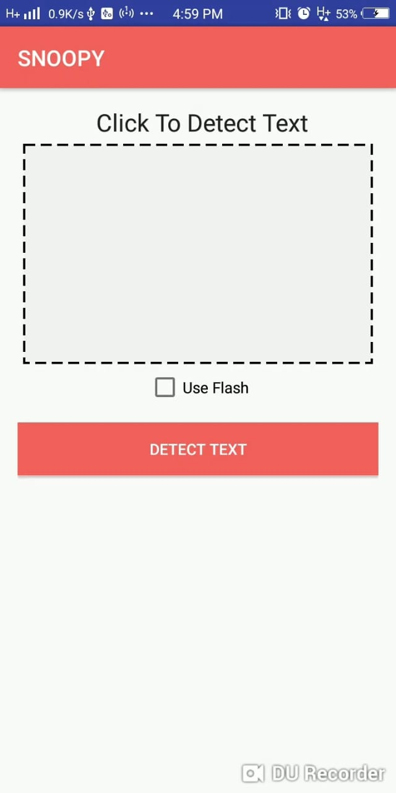
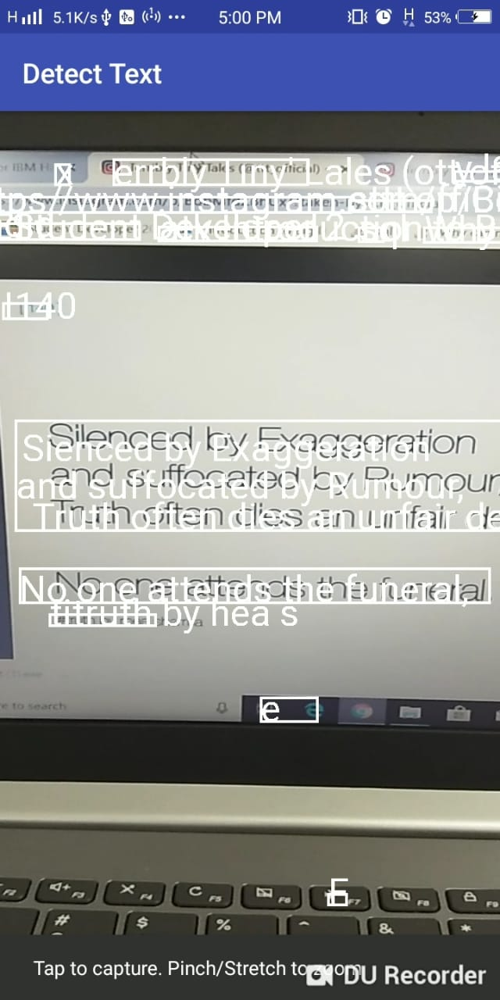
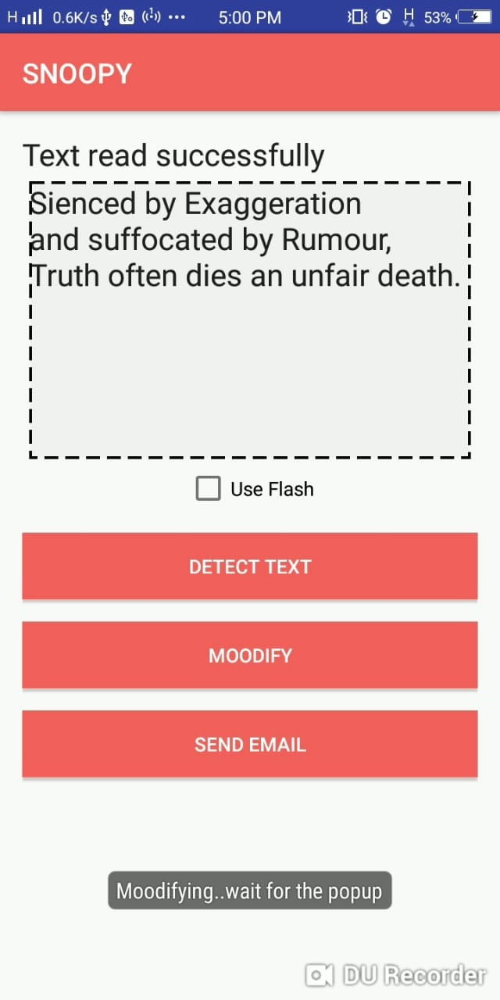
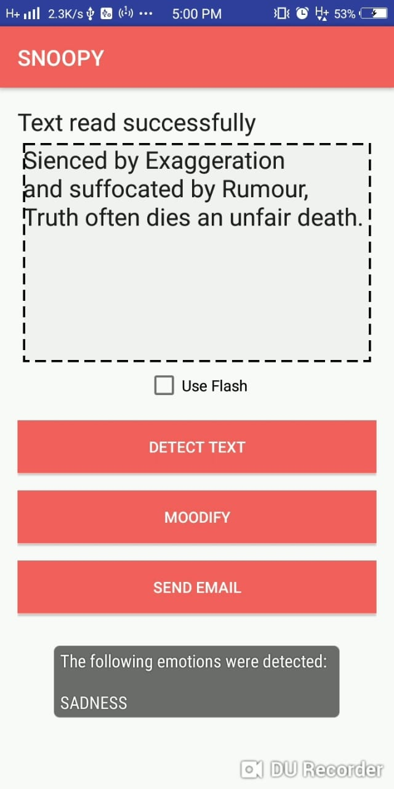

# OCR-Reader
An Android app to extract text from camera and analyze the Mood Of Text Using Tone Analyzer.

## Screenshots

## License
The content of this repository is licensed under [MIT LICENSE](LICENSE).
